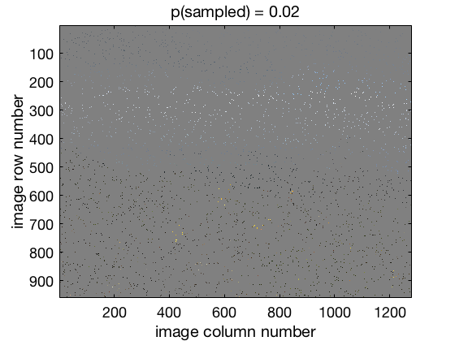
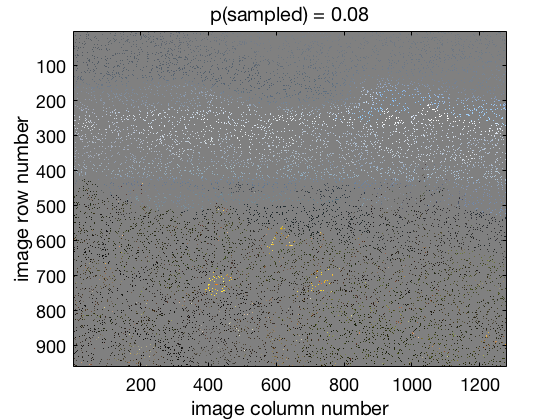

# Experiments as photography

When we take a picture of a scene, like a selfie of you and your friends, we create a digital image that consists of individual *picture elements*, called pixels for short. Each pixel is an "*observation*" of the color and brightness of a single point in the scene. If you have enough pixels, the picture is clear. \

But what if pixels suddenly became expensive to send, so expensive that you could only afford 2% - 2 pixels out of every 100 - in an image? Well, here's what an image from your summer vacation might look like:

Hm. Hard to tell what's going on, isn't it. Maybe there is a white band running across the picture near the top?  And there seems to be a lot of black in the bottom half with may some clusters of yellow pixels in the middle of the black.  \

This situation is tightly analogous to our situation after we've done an experiment; we have some data in the form of a sample (like the image) consisting of individual observations (like the pixels) that give us an incomplete picture of whatever we are studying. Our job as scientists is to figure out what's going on based on our data, just like we could try and figure out what the image above portrays. This would actually be quite difficult, because we simply don't have enough pixels! Let's pool our funds and buy some more! Here's the same image but with 8% of pixels now turned on:  

Now we can start to make some guesses about the scene at least... perhaps some snowy mountains under a cloudy sky in the background with maybe three yellow flowers in the foreground? 