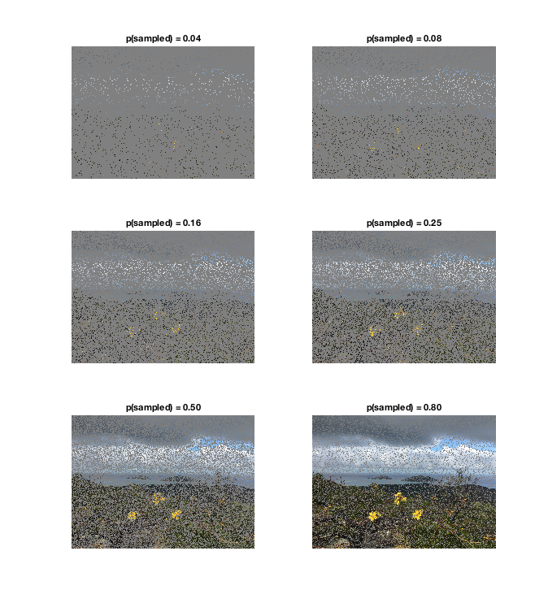
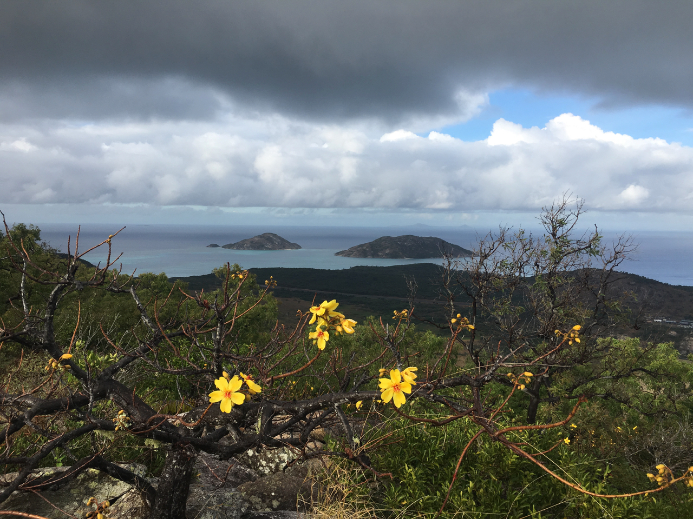

# Experiments as photography

When we take a picture of a scene, like a selfie of you and your friends, we create a digital image that consists of individual *picture elements*, called pixels for short. Each pixel is an "*observation*" of the color and brightness of a single point in the scene. If you have enough pixels, the picture is clear. \

But what if pixels suddenly became expensive to send, so expensive that you could only afford 2% - 2 pixels out of every 100 - in an image? Well, here's what an image from your summer vacation might look like:  \

  \
  Hm. Hard to tell what's going on, isn't it? Maybe there is a white band running across the picture near the top?  And there seems to be a lot of black in the bottom half with perhaps some clusters of yellow pixels in the middle of the black.  \

This situation is tightly analogous to our situation after we have collected some data; we have data in the form of a sample (the set of pixels that are turned on) consisting of individual observations (the pixels) that give us an incomplete picture of whatever we are studying. Our job as researchers is to figure out what's going on based on the data, just like we can try and figure out what the image above portrays. This would actually be quite difficult in that image, because we simply don't have enough pixels! Let's pool our funds and buy some more pixels! Here's the same image but with 8% of pixels now turned on:  

  \
  Now we can start to make some guesses about the scene at least... perhaps some snowy glaciated mountains under a cloudy sky in the background, with maybe three yellow things --- road markings? --- in the foreground?  \
  
Below is a series of images of the same scene with various percentages of the pixels turned on. Look at them left--to--right, top--to--bottom.  \

  \
  Here, we can easily appreciate that, the more pixels we have, the more easily and accurately see what is going on in the scene.  \
Here is the original image:

  \
  As we can see, none of the sampled images really do the original justice. Similarly, no real data set can reveal everything about the phenomenon under study. One thing very clear, however --- the more pixels we have, the better our ability to see details in the image. Here's the deal: ***The same thing is true for data sets.*** The bigger our sample is --- the more observations we have --- the better we can estimate things like the mean and standard deviation, and the better we can use the data to predict future outcomes. As we shall see, *the ability to estimate our uncertainty, to "know how much we know", based on how much data we have is one of the most import aspects of data analysis and data science*.
  